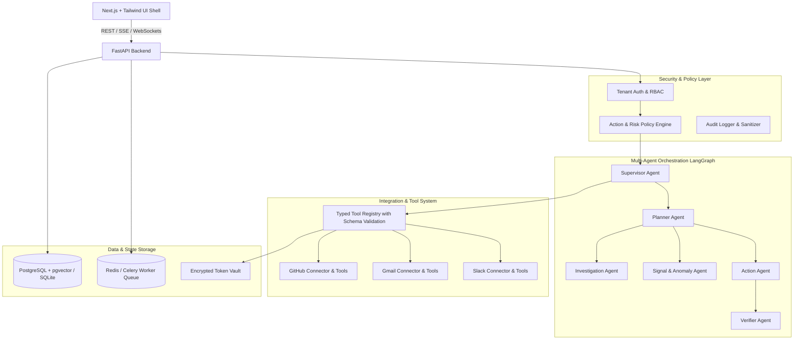

# StartupOps AI — Project Implementation Plan & Master Blueprint

**Version:** 1.0  
**Status:** In Progress  
**Specification Source:** `StartupOps_AI_Antigravity_Complete_Project_Specification.pdf`

---

## 1. Executive Summary & Goals

StartupOps AI is an enterprise-grade, multi-agent AI operating layer for startups. It connects live work systems (GitHub, Gmail, Slack, Jira, etc.), continuously ingests and normalizes operations events into structured evidence, correlates anomalies and cross-system issues, proposes typed actions with clear risk tiers, and executes approved actions under strict human-in-the-loop policies with verification and audit logging.

### Core Guarantees:
1. **Never a generic chatbot / upload-RAG:** Operates directly on live integrated systems with normalized evidence streams.
2. **Deterministic Safety:** No write action (email, message, commit, issue creation, etc.) is executed without explicit human approval.
3. **Multi-Tenant Isolation:** All records, credentials, agent states, and vector indexes strictly partitioned by `workspace_id`.
4. **Transparent Explainability:** Every finding links directly to immutable evidence items and hypotheses with confidence scores.
5. **Fail-safe Verification:** Post-execution verification checks whether real-world effects match the intended parameters.

---

## 2. System Architecture & Tech Stack

---

## 3. Detailed Phase Breakdown & Milestones

### Phase 1: Foundation, Tenancy, Security & Core Models
- **Database Schema**: Users, Workspaces, Members, Roles, Integration Accounts, Credentials, Conversations, Agent Runs, Evidence, Signals, Action Plans, Actions, Approvals, Audit Logs.
- **FastAPI Core**: Workspace middleware, JWT authentication, tenant isolation filters, encrypted credential store (AES-256-GCM), audit service.
- **Frontend Core**: Next.js 14+ App Router, Tailwind CSS, dark glassmorphic design system, workspace switcher, authentication context, responsive shell.

### Phase 2: Live Integrations & Normalized Evidence Engine
- **Connectors**:
  - GitHub: OAuth, repos, issues, pull requests, commits, workflow runs, check suites.
  - Gmail: OAuth, thread search, message reading, draft creation, sending write action.
  - Slack: OAuth, channel history, search, message drafting, posting write action.
- **Evidence Model**: Normalized JSON schema (`actor`, `object`, `action`, `timestamp`, `source`, `workspace_id`, `metadata`, `hash`).
- **Sync Engine**: Incremental cursor sync, webhook receivers, background ingestion workers.

### Phase 3: Gemini & LangGraph Multi-Agent Orchestration
- **Gemini Engine**: Google AI Studio Gemini 1.5 / 2.0 / 2.5 Flash / Pro integration via `google-genai` / REST SDK.
- **LangGraph State Graph**:
  - `Supervisor`: Intent routing, capability gatekeeping, prompt-injection defense.
  - `Planner`: Typed step decomposition, dependency resolution.
  - `GitHub / Email / Slack Specialists`: Domain tool callers with strict Pydantic input/output schemas.
- **Tool Registry**: Zero bypass policy, typed authorization matrix.

### Phase 4: Cross-System Correlation, Signals & Investigation Engine
- **Correlation Engine**: Linking GitHub PRs/releases -> Slack incident discussions -> Customer support emails.
- **Investigation Workspace UI**: Interactive timeline, interactive evidence drawer, hypothesis graph, confidence score breakdown, related signals.
- **Signal Engine**: Rolling baseline anomaly detector, spike detector, unassigned/stale PR detector, CI failure tracker.

### Phase 5: Action Engine, Human Approval Center & Post-Execution Verifier
- **Risk Engine**: Classification of actions into `LOW`, `MEDIUM`, `HIGH`, `CRITICAL`.
- **Approval Workflow**: Structured approval UI displaying target, raw parameters, diff/preview, blast radius, single & batch approval.
- **Execution & Idempotency**: Safe execution with unique idempotency keys and error recovery.
- **Verifier Agent**: Automated verification of executed actions against external API state.

### Phase 6: Machine Learning, Heuristics & Explainability
- **Anomaly Detection**: Robust statistical z-scores, exponential moving averages, clustering of customer complaints.
- **Feature Extraction & Ranking**: Priority scoring for signals and recommended investigation paths.
- **Explainability**: SHAP-like attribution breakdown for why a signal was triggered.

### Phase 7: Hardening, Security, Prompt Injection & Observability
- **Security Defenses**: Tenant isolation tests, prompt injection barriers (XML delimiters, untrusted data wrapping), SSRF protection on any outbound fetch.
- **Observability**: OpenTelemetry / structured JSON logs with `run_id`, `workspace_id`, `latency_ms`, token usage, provider error circuit breaker.

### Phase 8: Deployment, Seed Data & Acceptance Scenario
- **Docker Compose & Containerization**: Complete setup for backend, frontend, PostgreSQL, Redis.
- **Acceptance Scenario Seeder**: Complete end-to-end simulation of checkout failure release -> Slack outage discussion -> Gmail complaints -> Automated investigation -> Propose GitHub Issue + Slack update + Customer email draft -> Selective approval -> Verified execution.

---

## 4. Master Database Entities & Mappings

| Table Name | Description | Key Fields |
|---|---|---|
| `workspaces` | Tenant entity | `id`, `name`, `slug`, `created_at` |
| `users` | User accounts | `id`, `email`, `name`, `hashed_password` |
| `workspace_members` | Workspace memberships | `workspace_id`, `user_id`, `role` |
| `integration_accounts` | Connected external accounts | `id`, `workspace_id`, `provider`, `account_id`, `status` |
| `encrypted_credentials` | Token vault | `id`, `account_id`, `ciphertext`, `iv`, `scopes` |
| `evidence_items` | Normalized cross-system events | `id`, `workspace_id`, `source`, `actor`, `action`, `object`, `timestamp`, `raw_payload` |
| `signals` | Detected anomalies | `id`, `workspace_id`, `title`, `severity`, `status`, `signal_type`, `evidence_refs` |
| `investigations` | Deep dive cases | `id`, `workspace_id`, `title`, `summary`, `status`, `confidence`, `timeline`, `hypotheses` |
| `action_plans` | Proposed action batches | `id`, `investigation_id`, `workspace_id`, `title`, `status` |
| `actions` | Discrete executable actions | `id`, `action_plan_id`, `provider`, `action_type`, `payload`, `risk_level`, `status`, `idempotency_key` |
| `approvals` | Human sign-offs | `id`, `action_id`, `user_id`, `decision`, `comment`, `decided_at` |
| `execution_results` | Execution logs | `id`, `action_id`, `status`, `response_payload`, `executed_at` |
| `verification_results` | Post-exec checks | `id`, `action_id`, `verified`, `details`, `verified_at` |
| `audit_logs` | Immutable audit trail | `id`, `workspace_id`, `user_id`, `action_type`, `resource`, `metadata`, `timestamp` |

---

## 5. Execution Order
1. Setup project scaffold (`backend/`, `frontend/`, `docs/`, `infra/`).
2. Implement backend models, database engine (SQLAlchemy + SQLite/Postgres), security encryption, and FastAPI app with full test suite.
3. Build the Next.js frontend with modern Tailwind UI, glassmorphic layout, and complete screen suite.
4. Implement integrations (GitHub, Gmail, Slack) with OAuth flows and seed data handlers.
5. Implement LangGraph agent system with Gemini backend.
6. Implement the Acceptance Scenario and verify end-to-end.
